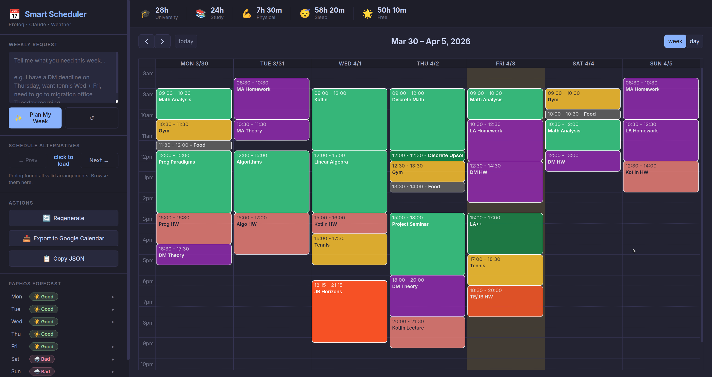

# Smart Scheduler

A personal weekly schedule planner that combines **SWI-Prolog** with **LLM natural language input** and **live weather data** to automatically generate optimal weekly schedules.

Built as a Programming Paradigms (Prolog) university project.



## Setup

### Option A — Docker (recommended)

```bash
cp .env.example .env
# Fill in ANTHROPIC_API_KEY and OPENWEATHERMAP_API_KEY

docker compose up --build
```

Open `http://localhost:5000`

### Option B — Local

**Requirements:** SWI-Prolog, Python 3.10+

```bash
pip install -r requirements.txt
cp .env.example .env
# Fill in API keys

python backend/app.py
```

## Architecture

```
Browser (FullCalendar.js)
        │  REST API
   Flask (Python)
    ├── pyswip ──► SWI-Prolog (greedy constraint scheduler)
    ├── Anthropic SDK ──► Claude Haiku (NL → Prolog terms)
    └── OpenWeatherMap API (Paphos 5-day forecast)
```

**Prolog** is the scheduling engine: it holds all facts (university timetable, priorities, budgets, constraints) and runs the greedy slot-placement algorithm. The Python backend is a thin REST layer — it calls Prolog via `pyswip`, converts results to JSON, and serves the frontend.
    
**Why Prolog?**
- Constraints are declarative: `incompatible_same_day(gym, tennis)`, `needs_good_weather(tennis)`, `buddy_available(dmitri, monday, 16.0, 20.0)` — no imperative search code.
- `findall/3` collects all valid schedule alternatives for Next/Prev browsing.
- Backtracking explores day/slot options naturally; `!` (cut) locks in greedy choices.
- Facts in `knowledge_base.pl` can be edited without touching the algorithm.

**Why LLM?**
Natural language is flexible. "I have a deadline Thursday" and "DM homework is due in 2 days" mean the same thing. Claude Haiku translates arbitrary phrasing into structured Prolog terms, while Prolog guarantees the result satisfies all constraints.

---

## Features

| Feature | Description |
|---|---|
| **Fixed university timetable** | 11 locked blocks + 1 semi-fixed per week |
| **Automatic HW scheduling** | Weekly time budgets per subject, split into ≤2h sessions |
| **Load-balanced distribution** | Least-loaded days scheduled first (not greedy Mon→Sun) |
| **Priority-based conflict resolution** | If time runs out, lower-priority events are dropped first |
| **Weather-aware** | Tennis and hiking only when Paphos forecast is good (3h slots) |
| **Tennis buddy** | Dmitri's Mon/Wed/Fri 16–20 availability constrains tennis |
| **Gym constraints** | Non-consecutive days, 9:00–18:00 only, closed Sunday |
| **Daily limits** | Max 2 math tasks, max 3 study tasks per day |
| **Deadline boost** | Mention a deadline → that task's priority rises by +3 (cap 9) |
| **Session splitting** | Tasks >2h automatically split into multiple ≤2h blocks |
| **Next / Prev** | Browse 7 schedule alternatives (bias-day rotation) |
| **iCal export** | `.ics` with Google Calendar color categories (RFC 7986) |
| **Copy JSON** | One-click schedule JSON for debugging |
| **Weekly stats** | University, study, physical, free time breakdown |
| **LLM input** | Weekly requests in plain English or Russian |

---

## Prolog Mechanisms Used

The project meaningfully uses all 6 Prolog mechanisms from Level A:

| Mechanism | Where | Example |
|---|---|---|
| **Recursion** | `dropped_warnings/2`, `sumlist/3` (tail-recursive with accumulator), `place_tasks_offset/9`, `recovery_violation/2`, `check_incompatible/3` | `sumlist([H\|T], Acc, Sum) :- NewAcc is Acc + H, sumlist(T, NewAcc, Sum).` |
| **Lists and `[H\|T]`** | Primary data structure everywhere — events, tasks, ranges, warnings, weather. Manual `[H\|T]` decomposition in `sumlist`, `dropped_warnings`, `place_tasks_offset`, `check_incompatible`, `recovery_violation`. | `dropped_warnings([Act\|Rest], [W\|Ws]) :- ...` |
| **`findall/3`** | Collecting fixed events, flexible tasks, schedule alternatives, day loads, overlap ranges, statistics. 15+ distinct uses. | `findall(Sched, (member(BiasDay,[0..6]), place_tasks_offset(...)), AllRaw)` |
| **Backtracking** | `find_slot_any` and `find_slot_in_window`: `member(Day, SortedDays), between(DayStart, DayEnd, StartSlot)` backtracks through days and slots until `slot_valid` succeeds. `all_schedules` uses `findall` over 7 bias-day alternatives, each exploring different day orderings via backtracking. `gym_consecutive` backtracks through `next_day` to check both adjacent days. | `member(Day, SortedDays), ..., slot_valid(...), !` |
| **Cut (`!`)** | Deliberate green cuts in `slot_valid` search (commit to first valid slot), `day_allowed` (fail-fast for Sunday gym), `gym_hours_ok`, `buddy_ok`, `weather_ok`, `tennis_window_ok`, `food_gym_ok` (commit to constraint check), `check_math_limit`/`check_study_limit` (only check limit for matching activities). Each cut has a clear purpose: either committing to a greedy choice or short-circuiting inapplicable constraint branches. | `gym_hours_ok(gym, S, E) :- !, S >= 9.0, E =< 18.0.` |
| **Multiple clauses** | `subject_color/2` (18 clauses), `math_flex/1` (5), `day_allowed/2` (2), `gym_consecutive/2` (2 — gym and food), `gym_hours_ok/3` (3), `food_gym_ok/4` (2), `buddy_ok/2` (2), `weather_ok/4` (2), `tennis_window_ok/3` (2), `already_on_day/3`, `check_math_limit/3` (2), `check_study_limit/3` (2), `slot_in_university_block/1` (2), `cognitive_load_ok/3` (3), `recovery_violation/2` (2) | Pattern matching in head: `gym_hours_ok(gym, S, E) :- ...` vs `gym_hours_ok(_, _, _).` |

**Level B additions:**
- **Python integration via pyswip** — Prolog handles logic, Python handles I/O (Flask REST API, LLM calls, weather API, iCal generation)
- **500+ lines of Prolog** — 1,159 lines across 4 modules (scheduler: 625, knowledge_base: 226, constraints: 202, utils: 107)
- **96 unit tests** via SWI-Prolog's `plunit` framework

---

## Fixed University Schedule

| Day | Time | Subject |
|---|---|---|
| Monday | 09:00–10:30 | Math Analysis |
| Monday | 12:00–15:00 | Programming Paradigms |
| Tuesday | 12:00–15:00 | Algorithms |
| Wednesday | 09:00–12:00 | Kotlin |
| Wednesday | 12:00–15:00 | Linear Algebra |
| Wednesday | 18:15–21:15 | JB Horizons (TE) |
| Thursday | 09:00–12:00 | Discrete Math |
| Thursday | 12:00–12:30 | Discrete Upsolve |
| Thursday | 15:00–18:00 | Project Seminar |
| Friday | 09:00–10:30 | Math Analysis |
| Saturday | 10:30–12:00 | Math Analysis |

Semi-fixed: **LA++** Friday 15:00–17:00 (student-taught, priority 6)

---

## Priority System (1–10)

| Priority | Activities |
|---|---|
| **10** | Migration office, critical admin |
| **9** | Deadline-boosted tasks (max boost) |
| **8** | MA HW, LA HW, core university classes |
| **7** | Math self-study (MA theory) |
| **6** | DM tasks, Kotlin HW, Prog HW, LA++ |
| **5** | DM theory, Algo HW, TE/JB HW, Kotlin lecture, Gym |
| **4** | Tennis |
| **2** | Hike, The HUB |
| **1** | Mafia |

Physical activities with narrow time windows get a **time-window bonus** in the sort key, making them schedule before homework of the same priority. This prevents homework from filling gym/tennis time windows.

---

## Constraints

### Hard (never violated)
- **Sleep block:** 00:00–08:20 every day
- **University blocks:** cannot be moved or overwritten
- **No event overlap** (30-min slot system with ceiling-based end slot for sub-slot precision)
- **Nothing past 22:00**

### Gym
- Open **9:00–18:00**, closed **Sunday**
- **Non-consecutive days** (e.g. Mon/Wed/Fri, not Mon/Tue)
- Max **1 session per day**
- **Food within 2 hours** after gym (same day, must follow gym)

### Physical incompatibilities (same day)
- hike + gym, hike + tennis, gym + tennis

### Weather (Paphos, Cyprus)
- Tennis and hike need **good weather** (no rain/thunderstorm, temp > 12°C)
- Uses **3-hour forecast slots** from OpenWeatherMap

### Tennis buddy — Dmitri
- Available: Mon, Wed, Fri 16:00–20:00
- Tennis constrained to **16:00–20:00** window on buddy days

### Daily limits (flexible tasks only)
- Max **2 math** tasks per day (ma_hw, la_hw, dm_tasks, dm_theory, ma_theory)
- Max **3 study** tasks per day (all homework + self_study types)

### Daily cognitive limits (soft — in `constraints.pl`)
- Math: **≤ 4 hours** per day (`daily_cognitive_limit(math, 240)`)
- Programming: **≤ 5 hours** per day (`daily_cognitive_limit(programming, 300)`)

### Recovery time (no heavy cognitive tasks after physical activity)
- After gym: **90 minutes** light tasks only
- After hike: **180 minutes** light tasks only

### Session duration
- Max single session: **2 hours** (longer budgets are split)

### Deadline boost
- Deadline within 2 days → priority +3, capped at 9

---

## How the Scheduling Algorithm Works

1. **Collect fixed events** from `university_class/4` and `semi_fixed/4` facts
2. **Collect flexible tasks** from `base_flexible_task/3`, apply deadline boosts, filter skipped activities
3. **Sort by effective priority** — higher priority first, with time-window bonuses for constrained activities (gym, tennis, hike, food)
4. **Greedy placement** — for each task in priority order:
   - Compute `biased_least_loaded_days` — days sorted by event count (ascending), with tie-breaking rotated by BiasDay
   - For each candidate day, scan 30-min slots within the preferred time window (morning for `prefers_time(_, morning)` activities)
   - Check `slot_valid/7` — 12 constraint checks including sleep, overlap, physical conflicts, gym hours, daily limits, buddy, weather
   - Cut (`!`) commits to the first valid slot found
   - If no slot found, the task is **dropped** and reported as a warning
5. **Generate alternatives** — `all_schedules/3` runs the algorithm 7 times with BiasDay 0–6, each rotating the day tie-breaking order, producing genuinely different schedules

---

## Project Structure

```
smart-scheduler/
├── README.md
├── docker-compose.yml
├── Dockerfile
├── requirements.txt
├── .env.example
├── prolog/
│   ├── knowledge_base.pl   # 226 lines — facts: timetable, activities, priorities, budgets, buddies
│   ├── constraints.pl      # 202 lines — rules: overlap, incompatibilities, recovery, weather, cognitive load
│   ├── scheduler.pl        # 625 lines — core algorithm: slot placement, color map, stats
│   ├── utils.pl            # 107 lines — time/slot arithmetic helpers
│   └── tests.pl            # 96 unit tests (plunit framework)
├── backend/
│   ├── app.py              # Flask REST routes
│   ├── prolog_bridge.py    # pyswip interface (thread-safe, regex parsing)
│   ├── llm_parser.py       # Claude Haiku → Prolog terms
│   ├── weather.py          # OpenWeatherMap 5-day/3h forecast
│   └── ical_export.py      # .ics generation with Google Calendar colors
├── frontend/
│   ├── index.html
│   ├── css/style.css
│   └── js/app.js           # FullCalendar + API logic
└── docker-compose.yml

---

## Running Tests

```bash
# Inside Docker
docker exec smart-scheduler swipl -g run_tests -t halt /app/prolog/tests.pl

# Locally (requires SWI-Prolog)
cd prolog && swipl -g run_tests -t halt tests.pl
```

96 tests across 16 test suites covering: slot conversions, day helpers, knowledge base integrity, overlap detection, incompatibilities, color mapping, fixed events, task collection, priority sorting, slot validation (gym hours, consecutive days, daily limits, food-gym dependency), full schedule generation (no overlaps, sleep block, gym constraints), alternatives, statistics, warnings, edge cases (skip, deadlines, oneoff tasks).


---

## Natural Language Commands (LLM Input)

The text input box accepts natural language in English. Claude Haiku parses it into structured Prolog terms. The scheduler supports 7 command types:

| Command | What it does | Example prompt |
|---|---|---|
| **pin_to_day** | Force one session to a specific day | *"Put DM theory on Saturday"* |
| **avoid_day** | Prevent activity on a specific day | *"No math homework on Friday"* |
| **skip_activity** | Remove ALL sessions this week | *"Skip gym this week"* |
| **add_oneoff** | Add a new one-time event | *"Meeting with advisor Tuesday at 14:00, 1 hour"* |
| **add_deadline** | Boost priority (+3, cap 9) | *"DM deadline on Thursday"* |
| **set_priority** | Override priority (1-10) | *"Make algo homework high priority"* |
| **add_task** | Add extra session beyond weekly budget | *"Extra 2 hours of MA study this week"* |

**Moving = pin + avoid.** "Move DM theory from Thursday to Saturday" generates:
```
pin_to_day(dm_theory, saturday)    % pin one session to Saturday
avoid_day(dm_theory, thursday)     % don't schedule any on Thursday
```

**User-pinned events bypass buddy/time-window constraints.** If you explicitly request tennis on Tuesday (outside Dmitri's Mon/Wed/Fri window), it will be placed — the system trusts your intent.

### Demo Queries

These are good prompts to demonstrate the system during a presentation:

**1. Basic — deadline boost** (shows priority system)
```
I have a Discrete Math deadline on Thursday
```

**2. Move activity** (shows pin_to_day + avoid_day)
```
Move DM theory from Thursday to Saturday
```

**3. Add event on unusual day** (shows oneoff + buddy override)
```
Add tennis on Tuesday. Also put gym on Wednesday.
```

**4. Skip + add** (shows skip + oneoff)
```
Skip tennis this week. Add a 2-hour meeting with tutor on Friday at 16:00.
```

**5. Complex multi-constraint** (shows several features at once)
```
DM deadline Thursday, skip gym, move LA homework to Sunday, make algo HW high priority
```

**6. Custom event** (shows add_oneoff for novel events)
```
I need to go to the migration office on Tuesday morning at 10:00 for 1 hour
```


---

## Google Calendar Color Scheme

Events match the user's Google Calendar palette:

| Color | Hex | Used for |
|---|---|---|
| Sage | `#33B679` | University lectures/labs |
| Flamingo | `#E67C73` | Programming homework |
| Tangerine | `#F4511E` | TE / startups |
| Banana | `#F6BF26` | Sports (gym, tennis, hike) |
| Basil | `#0B8043` | Additional DM/LA classes |
| Grape | `#8E24AA` | Self-study math homework |
| Graphite | `#616161` | Food / misc |
| Peacock | `#039BE5` | Default / admin |
| Blueberry | `#3F51B5` | HUB, social, tutor |

iCal export includes RFC 7986 `COLOR` and `X-APPLE-CALENDAR-COLOR` properties. Google Calendar ignores per-event color in `.ics` imports; the colors are visible in Apple Calendar and other RFC 7986–compatible clients.

---
